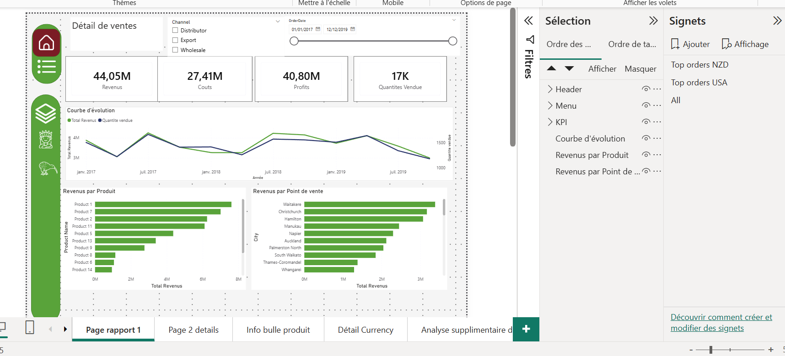
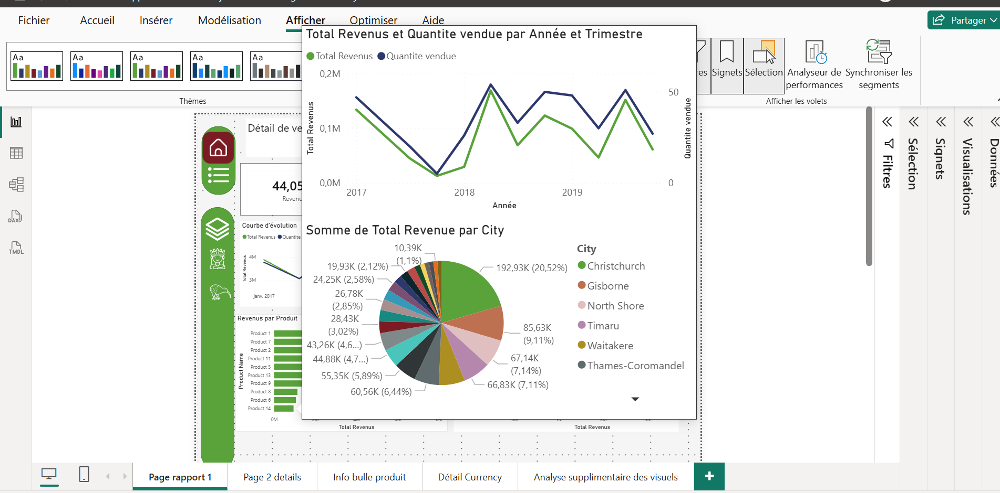
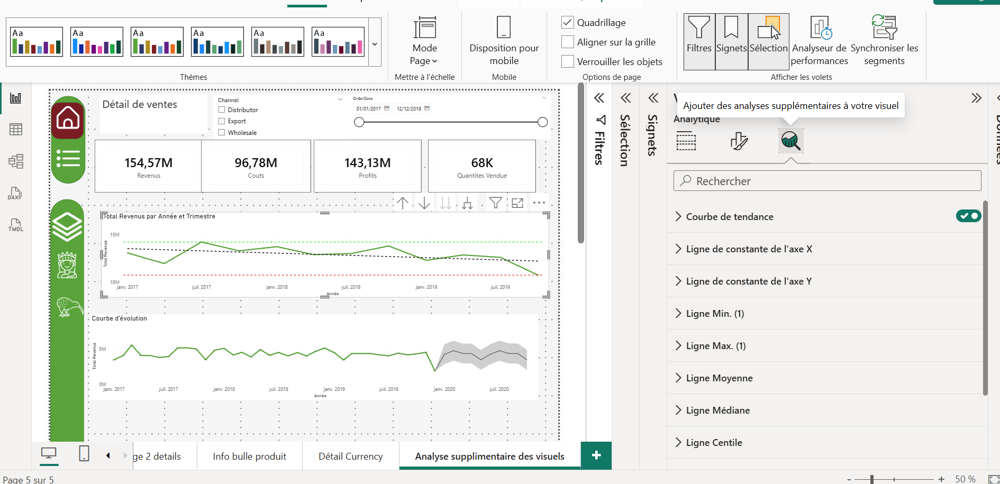

# 📊 Power BI – Data Visualisation Complète

Rapport Power BI couvrant les fonctionnalités avancées de data visualisation : signets, navigation, visuels IA, extraction, interrapport, What-if et rapports paginés.

---

## 🔖 Signets & Navigation

Mise en place d'une navigation dynamique avec signets pré-enregistrés pour filtrer les données sans perdre l'état du rapport.

- **Top orders USA** – filtré sur USD avec revenus ≥ 5000
- **Top orders NZD** – filtré sur la Nouvelle-Zélande
- **All** – réinitialisation complète des filtres

---

## 💬 Info-bulles Personnalisées

Création de pages info-bulles masquées pour l'utilisateur final, affichant des détails supplémentaires au survol d'un visuel.

---

## 📈 Analyse Supplémentaire des Visuels

Ajout de lignes de référence analytiques directement sur les visuels :

- Courbe de tendance
- Ligne Min / Max
- Ligne Moyenne & Médiane
- Ligne Centile
- Prévision automatique

---

## 🤖 Visuels IA

| Visuel | Rôle |
|---|---|
| **Influenceurs clés** | Identifie les facteurs qui font monter ou baisser une mesure |
| **Arbre de décomposition** | Descend dans les données niveau par niveau |
| **Questions & Réponses** | Interroge le modèle en langage naturel |
| **Narratives intelligentes** | Génère un commentaire textuel automatique |

---

## ⚡ Autres Fonctionnalités Couvertes

- **Interrapport** – navigation entre rapports avec transmission des filtres
- **Extraction (Drillthrough)** – navigation par extraction vers une page de détail
- **What-if Paramètre** – simulation de scénarios dynamiques avec curseur interactif
- **Regroupement & Binning** – regroupement de catégories et tranches numériques
- **Clustering** – regroupement automatique par IA
- **Rapport paginé** – conçu pour impression et export PDF
- **Vue mobile** – rapport adapté aux appareils mobiles
- **Synchronisation des segments** – filtres synchronisés entre plusieurs pages
- **Exportation des données** – données résumées et granulaires

---

## 📁 Fichiers

| Fichier | Description |
|---|---|
| `dashboard_data_viz.pbix` | Rapport complet Power BI |

---

## 🔜 À venir

- Publication sur **Power BI Service**
- Lien interactif du rapport en ligne
